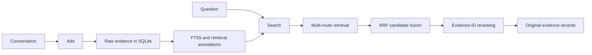

<p align="center">
  
</p>

<h1 align="center">ChronoHybridMem</h1>

<p align="center"><strong>Recuperación de memoria híbrida basada en evidencias para agentes de IA a largo plazo.</strong></p>

<p align="center">
  <a href="README.md">简体中文</a> |
  <a href="README.en.md">English</a> |
  <strong>Español</strong> |
  <a href="README.ja.md">日本語</a> |
  <a href="README.ko.md">한국어</a>
</p>

<!-- README_FACTS: main=stable-post-submission-research; p3=experimental; official-v020-mapping=CONFIRMED -->

<p align="center">
  Agent Memory Challenge · Academic Textual Memory · <strong>Rank 5</strong> · <strong>Overall 44.33</strong>
</p>

ChronoHybridMem es un servicio de memoria a largo plazo desplegable con Docker que almacena turnos de conversación y recupera las evidencias originales más pertinentes para una consulta. Se desarrolló para el Agent Memory Challenge y se limita deliberadamente a la recuperación de evidencias: no genera la respuesta final del benchmark.

La rama predeterminada, `main`, utiliza P4-A q2 + bm25 selection como su línea base estable y validada de investigación local posterior al envío (Hit@1 0.5850 sobre 1,976 consultas completables). El código P3 Evidence Graph sigue siendo una capacidad experimental desactivada por defecto y no forma parte de la ruta de recuperación estable.

## Qué hace el sistema

El benchmark separa la memoria de la generación de respuestas:

| ChronoHybridMem | Plataforma de la competición |
|---|---|
| `Add`: almacena evidencias de la conversación | `Answer`: razona sobre las evidencias recuperadas |
| `Search`: devuelve registros originales ordenados | `Evaluation`: puntúa la respuesta final y el comportamiento de la memoria |

Por ejemplo, supongamos que la memoria contiene:

```text
Bob gave Alice a book.
Bob works at Microsoft.
```

Para la pregunta «Where does the person who gave Alice the book work?», ChronoHybridMem recupera esos dos registros de origen. La plataforma —no el servicio de memoria— produce `Microsoft` como respuesta final.

## Arquitectura



El servicio estable se rige por seis principios:

- Las evidencias sin procesar son la fuente de verdad.
- Las anotaciones de recuperación nunca sustituyen las evidencias originales.
- Cada consulta al almacenamiento impone una partición exacta por `user_id`.
- Un reranker solo puede reordenar los ID de candidatos existentes.
- La búsqueda en memoria nunca genera la respuesta del benchmark.
- La reproducibilidad y las pruebas de regresión acotadas tienen prioridad sobre la complejidad adicional.

## Canalización estable actual: P4-A q2 + bm25 selection

La ruta estable predeterminada combina la planificación estructurada P1 con la recuperación independiente evidence-need de P4-A. P4-A recupera cada `evidence_need` mediante un canal independiente acotado y reserva 2 candidatos en el pool de reranking; los candidatos de las necesidades se ordenan por la mejor puntuación bm25 antes de que la cuota seleccione, de modo que se conservan los candidatos más fuertes. No añade llamadas al modelo Search ni genera respuestas. Use `MEMORY_EVIDENCE_NEED_RETRIEVAL=false` para reproducir la ruta P1 histórica.

### Add

1. Valida la solicitud con Pydantic.
2. Conserva los mensajes originales en SQLite con gestión idempotente de `request_id`.
3. Opcionalmente, utiliza `gpt-4o-mini` para crear anotaciones de hechos vinculadas a sus fuentes.
4. Indexa con FTS5 los mensajes sin procesar, los hechos, el texto con stemming de Porter y el contexto adyacente.

Las claves de hablante/fecha y las anotaciones del modelo mejoran la recuperación, pero `/search` siempre devuelve contenido de la tabla de mensajes original.

### Search

1. Aplica un filtrado exacto por `user_id`.
2. En modo modelo, planifica campos de consulta acotados: intención, términos principales, expansiones, entidades, indicios temporales y necesidades de evidencia.
3. Recupera mediante las rutas FTS5 de mensajes sin procesar, hechos, Porter y contexto adyacente.
4. Fusiona los candidatos con fusión por rango recíproco (RRF).
5. Opcionalmente, ordena un conjunto acotado de candidatos con `gpt-4o-mini`.
6. Filtra la salida del modelo mediante la lista de ID de candidatos permitidos proporcionada y devuelve las evidencias originales.

P1 reutiliza la llamada existente de planificación de consultas; no añade ninguna llamada al modelo ni modifica la API Add/Search. El servicio de API utiliza `MEMORY_STRUCTURED_QUERY_PLAN=true` de forma predeterminada; configúrelo como `false` para una ablación con planificador plano. El uso directo de `MemoryStore` y el evaluador LoCoMo sin conexión mantienen un criterio conservador: el evaluador exige la opción explícita `--structured-query-plan`. Sin una `OPENAI_API_KEY`, el servicio estándar sigue su ruta léxica y no llama a ningún modelo.

Los componentes opcionales BGE, ColBERT, cross-encoder, Qwen y otros modelos locales siguen siendo exclusivamente de investigación y no están implícitos en los valores predeterminados de la rama estable `main`.

## Resultados y nivel de evidencia

### A. Resultado oficial de la competición

| Modalidad | Puesto | Puntuación total | Versión histórica confirmada |
|---|---:|---:|---|
| Agent Memory Challenge — Academic Textual Memory | **5** | **44.33** | `v0.2.0` (**confirmada por la organización**) |

La organización ha confirmado formalmente que el resultado oficial corresponde a [`v0.2.0`](https://github.com/Tin11Mn/chrono-hybrid-mem/tree/v0.2.0), commit `7cf45c76ea7998554a13386b924627b83aeb3134`. Consulte el [registro de confirmación de la evaluación oficial](docs/OFFICIAL_EVALUATION_CONFIRMATION.md). P1 y P3 son investigaciones posteriores al envío y no deben interpretarse como nuevos envíos oficiales al leaderboard.

### B. Investigación local estable posterior al envío

El repositorio registra ejecuciones locales completas posteriores al envío en LoCoMo (proxy local Qwen3-4B, no resultados oficiales del leaderboard). El método actual más fuerte se evalúa sobre 1,976 consultas completables (el offset 758 se excluye de forma uniforme para todos los métodos porque esa conversación excesivamente larga cuelga de forma fiable el servidor de inferencia):

| Método | Hit@1 | Hit@3 | Hit@10 | MRR | Evidence Recall@10 |
|---|---:|---:|---:|---:|---:|
| Planificador estructurado P1 (línea base) | 0.5779 | 0.7176 | 0.7601 | 0.6497 | 0.5976* |
| P4-A q2 (ablación) | 0.5779 | 0.7201 | 0.7642 | 0.6504 | 0.5998* |
| P4-A q2 + bm25 selection | 0.5850 | 0.7323 | 0.7809 | 0.6618 | 0.6129 |
| **+ capa semántica Session-Fact (el mejor actual)** | **0.6108** | **0.7677** | **0.8219** | **0.6929** | **0.6558** |

* El Evidence Recall@10 de P1 / P4-A q2 usa el alcance histórico del pool de
evidencia de cada método; las dos últimas filas se recalculan por pregunta con
un único alcance compartido de acierto top-10 (gold mem_ids ∩ result_ids) y
son directamente comparables. Frente a la línea base proxy P1 emparejada sobre
el mismo conjunto de 1,976 preguntas, el mejor método actual mejora Hit@1 en
0.0329, Hit@10 en 0.0618 y MRR en 0.0432. Bootstrap pareado (10,000 remuestras)
frente a P4-A q2 + bm25 selection: Hit@1 Δ +0.0258, IC del 95 % [+0.0116,
+0.0400]; MRR Δ +0.0311, IC del 95 % [+0.0208, +0.0411] (ambos excluyen 0).
Consulte la [evaluación completa (1,976)](docs/EVALUATION_NEW_METHOD_1976.md),
los [resultados para el artículo](docs/CHRONOHYBRIDMEM_RESULTS_FOR_PAPER.md),
la [reproducción](docs/CHRONOHYBRIDMEM_REPRO_NEW_METHOD.md) y la
[Evaluación de P1 con un modelo local](docs/P1_LOCAL_EVALUATION.md) para conocer
el protocolo y los límites.

### C. Evidencia proxy y experimental

Las ejecuciones fixed-20, fixed-200, sintéticas similares a AML y de diagnóstico son filtros para seleccionar métodos, no resultados del leaderboard. El filtro fixed-200 de P1 mejoró el Hit@1 local de 0.545 a 0.565, manteniendo el Hit@10 en 0.740; posteriormente se registró el resultado completo anterior. El historial experimental detallado —incluidas las ideas rechazadas— se conserva en [findings.md](findings.md), [progress.md](progress.md) y la [documentación de evaluación](docs/EXTERNAL_EVALUATION.md).

Hit@K significa que al menos un turno de origen anotado aparece entre los primeros K resultados. MRR utiliza la posición del primer turno de origen anotado. Evidence Recall@K mide cuántos elementos de evidencia anotados se recuperaron.


## Experimentos del grafo de evidencias P3 (proxy local de LoCoMo)

P3 crea estructuras auxiliares trazables sobre mensajes originales sin generar contenido nuevo. Cada nodo y arista debe apuntar al mensaje fuente, y `/search` sigue devolviendo solo evidencia original. P3 está desactivado de forma predeterminada. Estos resultados se limitan al corte de desarrollo fijo de 20 preguntas de LoCoMo con Qwen3-4B como proxy local; no se pueden generalizar al conjunto oficial del leaderboard.

| Subexperimento | Método y resultado | Conclusión actual |
|---|---|---|
| P3-A grafo estricto de relaciones | Solo 3 aristas de relación con testigo independiente entre 419 mensajes originales (0.72% de cobertura de fuentes). | Cobertura de extracción insuficiente para evaluar recuperación pareada. |
| P3-B1 anclas de entidades locales a la fuente | Las menciones exactas de entidades cubrieron 363/419 mensajes fuente (86.63%); Hit@1 0.40 → 0.35, Hit@3 0.45 → 0.45, Hit@10 0.55 → 0.50, MRR 0.45 → 0.41. | Regresión en este corte; no es un valor predeterminado global. |
| P1.1 expansión de mensajes originales adyacentes | Hit@1/3/10/MRR igual al baseline: 0.40/0.45/0.55/0.45. | Sin mejora; no se amplía la evaluación. |
| P3-C grafo explícito de estado temporal | No se ha implementado una ablación independiente. | Sin probar; no hay conclusión sobre datos temporales. |

## Experimento P2 de reordenamiento consciente del conjunto (rechazado)

P2 intenta reordenar candidatos originales existentes después del ranking del modelo P1 usando términos de necesidades de evidencia del plan estructurado. Está desactivado por defecto y no añade llamadas al modelo. En un proxy local LoCoMo fijo de 20 preguntas, Hit@1 empató en `0.40` mientras Hit@3 y MRR mejoraron; sin embargo, en 35 casos públicos estratificados con planes congelados, Hit@1 cayó de `1.00` a `0.8571`, MRR de `1.00` a `0.9286` y aumentaron los casos de evidencia prohibida en primer lugar. P2 se conserva solo como experimento reproducible y análisis de fallos, nunca como ruta predeterminada ni afirmación de envío oficial.

Estos experimentos descartan activar por defecto el grafo o la expansión adyacente en LoCoMo, no los métodos de grafo en general. La activación futura dependerá solo de señales observables de relación, múltiples saltos o temporalidad de la entrada, nunca de la identidad de benchmarks privados ni de respuestas de referencia.

## Mapa de versiones

| Ref | Propósito | Estado |
|---|---|---|
| [`v0.1.0`](https://github.com/Tin11Mn/chrono-hybrid-mem/tree/v0.1.0) | Línea base mínima y fiable con SQLite/FTS | Versión archivada |
| [`v0.2.0`](https://github.com/Tin11Mn/chrono-hybrid-mem/tree/v0.2.0) | Versión oficial de la competición | Versión congelada; confirmada por la organización |
| [`research-v0.3.0`](https://github.com/Tin11Mn/chrono-hybrid-mem/tree/research-v0.3.0) | Hito híbrido local con BGE + ColBERT | Tag de investigación congelado |
| [`research-v0.4.0`](https://github.com/Tin11Mn/chrono-hybrid-mem/tree/research-v0.4.0) | Hito de reranker Qwen + clave con información temporal | Tag de investigación congelado |
| [`research-p1-20260816`](https://github.com/Tin11Mn/chrono-hybrid-mem/tree/research-p1-20260816) | Hito de planificación estructurada de consultas | Tag de investigación estable |
| [`main`](https://github.com/Tin11Mn/chrono-hybrid-mem) | Implementación de investigación estable, validada y actual posterior al envío | Activa |
| [`research/p3-evidence-graph`](https://github.com/Tin11Mn/chrono-hybrid-mem/tree/research/p3-evidence-graph) | Current best: P4-A evidence-need + bm25 + Session-Fact semantic layer (1,976-query Hit@1 0.6108) | Active research branch |

La ruta de desarrollo resumida es:

```text
v0.1 reliable SQLite/FTS baseline
  → v0.2 model-assisted fact extraction and evidence reranking
  → research-v0.3 dense retrieval and ColBERT
  → research-v0.4 Qwen reranking and a time-aware key
  → P1 structured query planning
  → P3 Evidence Graph research
```

Los componentes de investigación solo se promueven después de superar pruebas de regresión acotadas. La recuperación ligada a entidades, el filtrado de sesiones, las variantes de ColBERT, los rerankers de mayor tamaño y las ideas de reescritura de consultas se redujeron o rechazaron cuando una evaluación más amplia no las respaldó; se conservan como procedencia de la investigación en lugar de presentarlas de forma implícita como funciones estables.

## Inicio rápido

ChronoHybridMem está diseñado para Python 3.11.

```bash
git clone https://github.com/Tin11Mn/chrono-hybrid-mem.git
cd chrono-hybrid-mem
python -m venv .venv
```

Active el entorno:

```bash
# Linux/macOS
source .venv/bin/activate

# Windows PowerShell
.venv\Scripts\Activate.ps1
```

Instale e inicie el servicio ligero:

```bash
python -m pip install -r requirements.txt
python -m uvicorn app.main:app --host 0.0.0.0 --port 8000
```

Compruebe el estado del servicio:

```bash
curl http://localhost:8000/health
# {"status":"ok"}
```

`.env.example` es una referencia, no un archivo que se cargue automáticamente: el proyecto no instala `python-dotenv`. Exporte las variables en su shell, proporcione `--env-file` a Docker o utilice el gestor de secretos de su plataforma de despliegue.

## API

### `POST /add`

`request_id`, `user_id` y `session_id` son obligatorios. Reutilizar un `request_id` completado es idempotente y no duplica los mensajes.

```bash
curl -X POST http://localhost:8000/add \
  -H "Content-Type: application/json" \
  -d '{
    "request_id": "run:1:chunk:0",
    "user_id": "run:1:conversation:0",
    "session_id": "run:1:session:0",
    "messages": [
      {"role": "user", "content": "Alice prefers tea.", "timestamp": 1787068800}
    ]
  }'
```

### `POST /search`

El valor predeterminado de `top_k` es 100 y debe estar entre 1 y 100. `options` es opcional.

```bash
curl -X POST http://localhost:8000/search \
  -H "Content-Type: application/json" \
  -d '{
    "query": "What does Alice prefer?",
    "user_id": "run:1:conversation:0",
    "top_k": 10
  }'
```

Estructura de la respuesta:

```json
{
  "data": [
    {
      "id": "mem_1",
      "content": "Alice prefers tea.",
      "score": 0.0164,
      "created_at": "2026-08-18T00:00:00Z"
    }
  ]
}
```

`score` es una puntuación interna de recuperación/fusión, no una probabilidad calibrada, y no es directamente comparable entre configuraciones.

## Configuración y dependencias

Variables habituales:

| Variable | Valor predeterminado / función |
|---|---|
| `MEMORY_DB_PATH` | Ruta local de SQLite; el valor predeterminado en Docker es `/data/chrono_hybrid_mem.db` |
| `MEMORY_REQUIRE_MODEL` | `false`; configúrelo como `true` cuando el inicio basado en un modelo deba fallar si no hay una clave |
| `MEMORY_STRUCTURED_QUERY_PLAN` | `true` para el servicio de API; configúrelo como `false` para una ablación con planificador plano |
| `OPENAI_API_KEY` | Habilita la ruta del modelo remoto; inyéctela como secreto en tiempo de ejecución |
| `MEMORY_TEMPORAL_BONUS` | `0`; bonificación temporal léxica acotada opcional |

Consulte [`.env.example`](.env.example) para conocer las opciones de investigación local y las opciones de modelos mutuamente excluyentes.

Límites de las dependencias:

- [`requirements.txt`](requirements.txt): servicio de API ligero y runtime principal.
- [`requirements-test.txt`](requirements-test.txt): dependencias principales y de pruebas de la CI; añade NumPy para las pruebas del adaptador simulado de embeddings HTTP.
- [`requirements-local.txt`](requirements-local.txt): stack de investigación opcional de FastEmbed. Los pesos de los modelos solo se descargan cuando se instancia un componente local y nunca se incluyen en los commits.

## Docker

Construya la imagen del servicio estándar:

```bash
docker build -t chrono-hybrid-mem:latest .
docker run --rm -p 8000:8000 \
  -v chrono-memory-data:/data \
  chrono-hybrid-mem:latest
```

Para la ruta del modelo remoto al estilo de la competición, añada `-e MEMORY_REQUIRE_MODEL=true -e OPENAI_API_KEY=...` en tiempo de ejecución; nunca incorpore la clave en la imagen.

La imagen opcional de investigación local instala FastEmbed y utiliza de forma predeterminada BGE-large junto con un reranker ColBERT pequeño:

```bash
docker build -f Dockerfile.local -t chrono-hybrid-mem:local .
docker run --rm -p 8000:8000 \
  -v chrono-memory-data:/data \
  -v chrono-local-models:/models \
  chrono-hybrid-mem:local
```

El primer inicio puede descargar archivos de modelo de gran tamaño y requiere recursos de red, disco y memoria adecuados. `Dockerfile.local` representa la ruta de investigación de FastEmbed al estilo de v0.3; no permite reproducir con un solo comando la ejecución de P1 con Qwen.

## Evaluación

Ejecute el pequeño fixture ficticio de smoke test:

```bash
python scripts/evaluate_retrieval.py --cases examples/demo_eval.json
```

Ejecute prefijos deterministas de LoCoMo o el conjunto completo de preguntas aptas desde una ruta local aprobada para el dataset:

```bash
# fixed 20
python scripts/evaluate_locomo_retrieval.py \
  --dataset /path/to/locomo10.json --top-k 1,3,10 --max-questions 20

# fixed 200
python scripts/evaluate_locomo_retrieval.py \
  --dataset /path/to/locomo10.json --top-k 1,3,10 --max-questions 200

# full set: omit --max-questions
python scripts/evaluate_locomo_retrieval.py \
  --dataset /path/to/locomo10.json --top-k 1,3,10
```

`--max-questions` selecciona un prefijo fijo, no una muestra aleatoria. El protocolo de P1 con Qwen local exige además un servidor en loopback, `--local-search-model-url` y `--structured-query-plan`; utilice el procedimiento reanudable exacto descrito en [docs/P1_LOCAL_EVALUATION.md](docs/P1_LOCAL_EVALUATION.md).

Para una verificación ordinaria:

```bash
python -m pip install -r requirements-test.txt
python -m pytest
python -m compileall app tests scripts
```

La CI mantiene límites explícitos: `Verify / core-verification` es la tarea ligera principal para los PR; `Local Research Smoke` está limitado por rutas o se activa manualmente, y nunca inicia descargas de modelos. Las evaluaciones externas de LoCoMo y las evaluaciones de pago con `gpt-4o-mini` son flujos de trabajo manuales. El repositorio no tiene actualmente ninguna regla de protección de ramas, por lo que GitHub no exige técnicamente ninguna comprobación de estado.

## Estructura del repositorio

```text
app/         FastAPI service, schemas, SQLite storage, retrieval, model adapters
tests/       API, isolation, retrieval, model-contract, and evaluation tests
scripts/     deterministic diagnostics and LoCoMo evaluation tools
evaluation/  AML-like synthetic evaluation material
docs/        protocol, leaderboard audit, diagnostics, and P1 reports
assets/      shared project artwork
```

## Límites de reproducibilidad y seguridad

- Python 3.11 y los archivos de dependencias con versiones fijadas definen el entorno compatible.
- SQLite es la fuente duradera de los mensajes sin procesar; las bases de datos generadas y los resultados de evaluación se ignoran.
- Los predicados exactos de `user_id` aíslan los registros almacenados, pero la API no incorpora autenticación. Los despliegues de producción deben autenticar a quienes realizan las llamadas y vincular su identidad a `user_id` en la capa de servicio exterior.
- La consulta, las opciones y el texto de la memoria se tratan como datos de prompt no confiables; la lista de candidatos permitidos limita la salida del modelo. Se trata de una mitigación, no de una afirmación de prevención completa de la inyección de prompts.
- Habilitar la ruta respaldada por OpenAI envía el contenido pertinente de mensajes, consultas y candidatos al servicio de modelo remoto configurado.
- El repositorio no proporciona cifrado de la base de datos en reposo, terminación TLS ni limitación de frecuencia de la API.
- Hasta superar los filtros de promoción declarados, P3 sigue siendo una capacidad experimental desactivada por defecto en `main`; el comportamiento estable de P1 debe permanecer sin cambios durante su evaluación.

## Cita y licencia

No se afirma la existencia de un artículo formal del proyecto. Si utiliza ChronoHybridMem en una investigación, cite este repositorio o la versión/tag correspondiente.

Publicado bajo la [Licencia MIT](LICENSE). Copyright © Haoxuan Meng.
