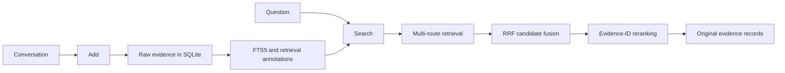

<p align="center">
  
</p>

<h1 align="center">ChronoHybridMem</h1>

<p align="center"><strong>長期稼働する AI エージェントのための、根拠に基づくハイブリッドメモリ検索。</strong></p>

<p align="center">
  <a href="README.md">简体中文</a> |
  <a href="README.en.md">English</a> |
  <a href="README.es.md">Español</a> |
  <strong>日本語</strong> |
  <a href="README.ko.md">한국어</a>
</p>

<!-- README_FACTS: main=stable-post-submission-research; p3=experimental; official-v020-mapping=CONFIRMED -->

<p align="center">
  Agent Memory Challenge · Academic Textual Memory · <strong>Rank 5</strong> · <strong>Overall 44.33</strong>
</p>

ChronoHybridMem は、会話ターンを保存し、クエリとの関連性が最も高い原典の根拠を検索する、Docker でデプロイ可能な長期メモリサービスです。Agent Memory Challenge のために開発され、意図的に根拠検索までを責務としています。ベンチマークの最終回答は生成しません。

デフォルトブランチの `main` は、検証済みで安定した提出後ローカル研究のベースラインとして、P4-A q2 + bm25 selection を使用します（Hit@1 0.5850、1,976 件の実行可能なクエリに基づく）。P3 Evidence Graph のコードは、既定で無効な実験的研究機能のままであり、安定した検索パスの一部ではありません。

## システムの役割

ベンチマークでは、メモリと回答が分離されています。

| ChronoHybridMem | コンペティションプラットフォーム |
|---|---|
| `Add`：会話の根拠を保存 | `Answer`：検索された根拠に基づいて推論 |
| `Search`：順位付けされた原典レコードを返却 | `Evaluation`：最終回答とメモリの挙動を採点 |

たとえば、メモリに次の内容が保存されているとします。

```text
Bob gave Alice a book.
Bob works at Microsoft.
```

「Alice に本を渡した人物はどこで働いていますか？」という質問に対し、ChronoHybridMem はこの二件の原典レコードを検索します。最終回答として `Microsoft` を生成するのは、メモリサービスではなくプラットフォームです。

## アーキテクチャ



安定版サービスは、次の六原則に従います。

- 生の根拠を信頼できる唯一の情報源とします。
- 検索用アノテーションで原典の根拠を置き換えません。
- すべてのストレージクエリで、厳密な `user_id` 分離を適用します。
- リランカーは、既存の候補 ID の順序だけを変更できます。
- メモリの Search は、ベンチマークの回答を生成しません。
- 複雑さを増す前に、再現性と範囲を限定した回帰テストを優先します。

## 現在の安定版パイプライン：P4-A q2 + bm25 selection

安定した既定経路は、P1 の構造化クエリ計画と P4-A の evidence-need 独立検索を組み合わせます。P4-A は各 `evidence_need` を制限付き独立チャネルで検索し、再ランキングプールに候補を 2 件予約します。need 候補はクォータ選択の前に最良の bm25 スコア順に並べられ、最も強い候補が保持されます。Search モデル呼び出しを増やさず、回答も生成しません。`MEMORY_EVIDENCE_NEED_RETRIEVAL=false` を設定すると履歴上の P1 経路を再現できます。

### Add

1. Pydantic でリクエストを検証します。
2. べき等な `request_id` 処理を使用し、原文メッセージを SQLite に永続化します。
3. 必要に応じて `gpt-4o-mini` を使用し、出典に紐づく事実アノテーションを作成します。
4. 生のメッセージ、事実、Porter ステミング済みテキスト、隣接コンテキストを FTS5 でインデックス化します。

話者・日付キーとモデルによるアノテーションは検索を改善しますが、`/search` が返す内容は常に原文メッセージテーブルに由来します。

### Search

1. 厳密な `user_id` フィルタリングを適用します。
2. モデルモードでは、意図、主要語、展開語、エンティティ、時間的手掛かり、必要な根拠から成る、範囲を限定したクエリフィールドを計画します。
3. 生のメッセージ、事実、Porter、隣接コンテキストの各 FTS5 経路で検索します。
4. reciprocal rank fusion（RRF）で候補を統合します。
5. 必要に応じて `gpt-4o-mini` を使い、範囲を限定した候補集合を並べ替えます。
6. モデル出力を、与えられた候補 ID の許可リストと照合して絞り込み、原典の根拠を返します。

P1 は既存のクエリ計画呼び出しを再利用します。モデル呼び出しを追加せず、Add/Search API も変更しません。API サービスのデフォルトは `MEMORY_STRUCTURED_QUERY_PLAN=true` です。フラットプランナーによるアブレーションでは `false` に設定してください。`MemoryStore` を直接使用する場合と、オフラインの LoCoMo 評価器では、引き続き保守的な挙動を採用します。評価器では明示的な `--structured-query-plan` フラグが必要です。`OPENAI_API_KEY` がない場合、標準サービスは字句検索経路を使用し、モデルを呼び出しません。

オプションの BGE、ColBERT、cross-encoder、Qwen、そのほかのローカルモデルコンポーネントは、引き続き研究専用です。安定版 `main` のデフォルトに含まれることを意味しません。

## 結果と根拠レベル

### A. 公式コンペティション結果

| トラック | 順位 | 総合 | 確認済みの過去バージョン |
|---|---:|---:|---|
| Agent Memory Challenge — Academic Textual Memory | **5** | **44.33** | `v0.2.0`（**主催者確認済み**） |

主催者は、公式結果が [`v0.2.0`](https://github.com/Tin11Mn/chrono-hybrid-mem/tree/v0.2.0)、コミット `7cf45c76ea7998554a13386b924627b83aeb3134` に対応することを正式に確認しました。[公式評価確認記録](docs/OFFICIAL_EVALUATION_CONFIRMATION.md)を参照してください。P1 と P3 は提出後の研究であり、新たな公式リーダーボードへの提出結果として解釈してはなりません。

### B. 安定した提出後のローカル研究

このリポジトリには、LoCoMo（ローカルの Qwen3-4B プロキシ。公式リーダーボードの結果ではない）での提出後ローカル実行の全結果が記録されています。現在最良の手法は 1,976 件の実行可能なクエリで評価されています（オフセット 758 は、その過度に長い会話が推論サーバーを確実にハングアップさせるため、すべての手法で一様に除外）:

| 手法 | Hit@1 | Hit@3 | Hit@10 | MRR | Evidence Recall@10 |
|---|---:|---:|---:|---:|---:|
| P1 structured planner（ベースライン） | 0.5779 | 0.7176 | 0.7601 | 0.6497 | 0.5976* |
| P4-A q2（アブレーション） | 0.5779 | 0.7201 | 0.7642 | 0.6504 | 0.5998* |
| **P4-A q2 + bm25 selection（現在最良）** | **0.5850** | **0.7323** | **0.7809** | **0.6618** | **0.6086** |

これらは提出後の LoCoMo ローカル研究結果であり、公式リーダーボードの結果ではありません。同一の 1,976 問セット上で、対応する P1 プロキシベースラインと比較すると、現在最良の手法（P4-A q2 + bm25 selection）は Hit@1 を 0.0071、Hit@10 を 0.0208、MRR を 0.0121 改善します。ペア付きブートストラップ（10,000 回のリサンプル）の 95% CI：Hit@1 [-0.0051, +0.0197]（0 を含むため有意とは主張しない）、MRR [+0.0036, +0.0207] および Hit@10 [+0.0116, +0.0299]（いずれも 0 を除外）。nDCG@10 は 0.6914。Recall@5 は 0.7606。プロトコルと境界については、[全件評価（1,976）](docs/EVALUATION_NEW_METHOD_1976.md)、[論文用の結果](docs/CHRONOHYBRIDMEM_RESULTS_FOR_PAPER.md)、[再現手順](docs/CHRONOHYBRIDMEM_REPRO_NEW_METHOD.md)、[P1 ローカルモデル評価](docs/P1_LOCAL_EVALUATION.md)を参照してください。

### C. プロキシおよび実験的な根拠

固定 20 問、固定 200 問、AML 類似の合成データ、診断用の各実行は、リーダーボード結果ではなく、手法選択のためのゲートです。P1 の固定 200 問ゲートでは、ローカルの Hit@1 が 0.545 から 0.565 に改善し、Hit@10 は 0.740 を維持しました。その後、上記の全件結果が記録されました。不採用となったアイデアを含む詳細な実験履歴は、[findings.md](findings.md)、[progress.md](progress.md)、[評価ドキュメント](docs/EXTERNAL_EVALUATION.md)に保存されています。

Hit@K は、最初の K 件の結果に、アノテーションされた出典ターンが一件以上含まれることを意味します。MRR には、最初に現れたアノテーション済み出典ターンの順位を使用します。Evidence Recall@K は、アノテーションされた根拠項目を何件検索できたかを測定します。


## P3 証拠グラフ実験（LoCoMo ローカル代理）

P3 は新しい内容を生成せず、元メッセージに追跡可能な補助証拠構造を構築します。すべてのノードとエッジはソースメッセージを指し、`/search` は引き続き元の証拠のみを返します。P3 は既定で無効です。以下は Qwen3-4B をローカル代理として用いた固定 20 問の LoCoMo 開発スライスに限定され、公式 leaderboard 全体には一般化できません。

| サブ実験 | 方法と結果 | 現時点の結論 |
|---|---|---|
| P3-A 厳格な関係グラフ | 419 件の元メッセージから独立に裏付けられた関係エッジは 3 件のみ（ソース被覆率 0.72%）。 | 抽出被覆率が低すぎ、対比較検索評価には進まなかった。 |
| P3-B1 ソース局所エンティティアンカー | 厳密なエンティティ言及は 363/419 件のソースメッセージをカバー（86.63%）。Hit@1 0.40 → 0.35、Hit@3 0.45 → 0.45、Hit@10 0.55 → 0.50、MRR 0.45 → 0.41。 | このスライスでは劣化し、グローバル既定にはしない。 |
| P1.1 隣接元メッセージ拡張 | Hit@1/3/10/MRR は baseline と同一：0.40/0.45/0.55/0.45。 | 改善なし。評価を拡大しない。 |
| P3-C 明示的時間状態グラフ | 独立したアブレーションは未実装。 | 未検証であり、時間データへの結論は出せない。 |

## P2 セット認識再ランキング実験（却下）

P2 は、構造化計画の証拠ニーズ語を用いて、P1 のモデルランキング後に既存の元候補を並べ替えます。既定で無効であり、モデル呼び出しは増えません。固定20問のローカル LoCoMo 代理では Hit@1 は `0.40` で同率、Hit@3 と MRR は改善しました。しかし、計画を凍結した公開合成の層化35ケースでは、Hit@1 は `1.00` から `0.8571`、MRR は `1.00` から `0.9286` に低下し、禁止証拠が最上位になる頻度も増えました。P2 は再現可能な実験と失敗分析としてのみ保持し、既定経路や公式提出の主張には使用しません。

これらは LoCoMo でグラフまたは隣接拡張を既定で有効化する仮説を棄却したもので、グラフ手法一般を否定するものではありません。今後は入力から観測できる関係、多段、時間シグナルだけで有効化し、非公開ベンチマークの識別子や正解には適応しません。

## バージョン対応表

| Ref | 目的 | 状態 |
|---|---|---|
| [`v0.1.0`](https://github.com/Tin11Mn/chrono-hybrid-mem/tree/v0.1.0) | 信頼性の高い最小構成の SQLite/FTS ベースライン | アーカイブ済みリリース |
| [`v0.2.0`](https://github.com/Tin11Mn/chrono-hybrid-mem/tree/v0.2.0) | 公式コンペティション版 | 固定済みリリース。主催者確認済み |
| [`research-v0.3.0`](https://github.com/Tin11Mn/chrono-hybrid-mem/tree/research-v0.3.0) | BGE + ColBERT ローカルハイブリッドのマイルストーン | 固定済み研究タグ |
| [`research-v0.4.0`](https://github.com/Tin11Mn/chrono-hybrid-mem/tree/research-v0.4.0) | Qwen リランカー + time-aware-key のマイルストーン | 固定済み研究タグ |
| [`research-p1-20260816`](https://github.com/Tin11Mn/chrono-hybrid-mem/tree/research-p1-20260816) | 構造化クエリ計画のマイルストーン | 安定版研究タグ |
| [`main`](https://github.com/Tin11Mn/chrono-hybrid-mem) | 現在検証済みで安定している提出後の研究実装 | 運用中 |
| [`research/p3-evidence-graph`](https://github.com/Tin11Mn/chrono-hybrid-mem/tree/research/p3-evidence-graph) | Current best: P4-A evidence-need + bm25 (1,976-query Hit@1 0.5850) | Active research branch |

開発経路を簡潔に示すと、次のとおりです。

```text
v0.1 reliable SQLite/FTS baseline
  → v0.2 model-assisted fact extraction and evidence reranking
  → research-v0.3 dense retrieval and ColBERT
  → research-v0.4 Qwen reranking and a time-aware key
  → P1 structured query planning
  → P3 Evidence Graph research
```

研究コンポーネントは、範囲を限定した回帰テストに合格した場合にのみ昇格します。エンティティ単位の検索、セッションフィルタリング、ColBERT の派生方式、大規模なリランカー、クエリ書き換えのアイデアは、広範な評価で裏付けられなかった場合に縮小または不採用としました。これらは安定版機能として暗黙に提示せず、研究の来歴として保存しています。

## クイックスタート

ChronoHybridMem は Python 3.11 を対象としています。

```bash
git clone https://github.com/Tin11Mn/chrono-hybrid-mem.git
cd chrono-hybrid-mem
python -m venv .venv
```

仮想環境を有効化します。

```bash
# Linux/macOS
source .venv/bin/activate

# Windows PowerShell
.venv\Scripts\Activate.ps1
```

軽量サービスをインストールして起動します。

```bash
python -m pip install -r requirements.txt
python -m uvicorn app.main:app --host 0.0.0.0 --port 8000
```

ヘルスチェックを実行します。

```bash
curl http://localhost:8000/health
# {"status":"ok"}
```

`.env.example` は参照用であり、自動的に読み込まれるファイルではありません。このプロジェクトは `python-dotenv` をインストールしません。変数はシェルでエクスポートするか、Docker の `--env-file` で渡すか、デプロイ先プラットフォームのシークレットマネージャーを使用してください。

## API

### `POST /add`

`request_id`、`user_id`、`session_id` は必須です。完了済みの `request_id` を再利用しても処理はべき等で、メッセージは重複しません。

```bash
curl -X POST http://localhost:8000/add \
  -H "Content-Type: application/json" \
  -d '{
    "request_id": "run:1:chunk:0",
    "user_id": "run:1:conversation:0",
    "session_id": "run:1:session:0",
    "messages": [
      {"role": "user", "content": "Alice prefers tea.", "timestamp": 1787068800}
    ]
  }'
```

### `POST /search`

`top_k` のデフォルトは 100 で、1 以上 100 以下である必要があります。`options` は任意です。

```bash
curl -X POST http://localhost:8000/search \
  -H "Content-Type: application/json" \
  -d '{
    "query": "What does Alice prefer?",
    "user_id": "run:1:conversation:0",
    "top_k": 10
  }'
```

レスポンスの形式は次のとおりです。

```json
{
  "data": [
    {
      "id": "mem_1",
      "content": "Alice prefers tea.",
      "score": 0.0164,
      "created_at": "2026-08-18T00:00:00Z"
    }
  ]
}
```

`score` は内部の検索・統合スコアであり、較正済みの確率ではありません。また、構成が異なる場合に直接比較することはできません。

## 構成と依存関係

主な変数は次のとおりです。

| 変数 | デフォルト値 / 役割 |
|---|---|
| `MEMORY_DB_PATH` | ローカル SQLite のパス。Docker のデフォルトは `/data/chrono_hybrid_mem.db` |
| `MEMORY_REQUIRE_MODEL` | `false`。モデルを使用する起動時にキーがなければ失敗させる場合は `true` に設定 |
| `MEMORY_STRUCTURED_QUERY_PLAN` | API サービスでは `true`。フラットプランナーによるアブレーションでは `false` に設定 |
| `OPENAI_API_KEY` | リモートモデル経路を有効化。実行時シークレットとして注入 |
| `MEMORY_TEMPORAL_BONUS` | `0`。任意で使用できる、範囲を限定した字句ベースの時間的ボーナス |

ローカル研究用の切り替え設定と、相互排他的なモデルオプションについては、[`.env.example`](.env.example)を参照してください。

依存関係の境界は次のとおりです。

- [`requirements.txt`](requirements.txt)：軽量 API サービスとコアランタイム。
- [`requirements-test.txt`](requirements-test.txt)：CI が使用するコア / テスト依存関係。モック HTTP 埋め込みアダプタのテスト用に NumPy を追加します。
- [`requirements-local.txt`](requirements-local.txt)：任意の FastEmbed 研究スタック。モデルの重みはローカルコンポーネントのインスタンス化時にのみダウンロードされ、コミットされることはありません。

## Docker

標準サービスのイメージをビルドします。

```bash
docker build -t chrono-hybrid-mem:latest .
docker run --rm -p 8000:8000 \
  -v chrono-memory-data:/data \
  chrono-hybrid-mem:latest
```

コンペティション形式のリモートモデル経路を使用する場合は、実行時に `-e MEMORY_REQUIRE_MODEL=true -e OPENAI_API_KEY=...` を追加してください。キーをイメージに埋め込まないでください。

オプションのローカル研究用イメージは FastEmbed をインストールし、デフォルトで BGE-large と小規模な ColBERT リランカーを使用します。

```bash
docker build -f Dockerfile.local -t chrono-hybrid-mem:local .
docker run --rm -p 8000:8000 \
  -v chrono-memory-data:/data \
  -v chrono-local-models:/models \
  chrono-hybrid-mem:local
```

初回起動時には大容量のモデルファイルがダウンロードされる場合があり、十分なネットワーク帯域、ディスク容量、メモリが必要です。`Dockerfile.local` は v0.3 形式の FastEmbed 研究経路を表します。P1 の Qwen 実行をワンコマンドで再現するものではありません。

## 評価

小規模な架空データのスモークフィクスチャを実行します。

```bash
python scripts/evaluate_retrieval.py --cases examples/demo_eval.json
```

承認済みのローカルデータセットパスから、決定論的な LoCoMo の先頭部分または対象全件を実行します。

```bash
# fixed 20
python scripts/evaluate_locomo_retrieval.py \
  --dataset /path/to/locomo10.json --top-k 1,3,10 --max-questions 20

# fixed 200
python scripts/evaluate_locomo_retrieval.py \
  --dataset /path/to/locomo10.json --top-k 1,3,10 --max-questions 200

# full set: omit --max-questions
python scripts/evaluate_locomo_retrieval.py \
  --dataset /path/to/locomo10.json --top-k 1,3,10
```

`--max-questions` はランダムサンプルではなく、固定された先頭部分を選択します。P1 の local-Qwen プロトコルには、ループバックサーバー、`--local-search-model-url`、`--structured-query-plan` も必要です。正確な再開可能手順は [docs/P1_LOCAL_EVALUATION.md](docs/P1_LOCAL_EVALUATION.md) を使用してください。

通常の検証では、次を実行します。

```bash
python -m pip install -r requirements-test.txt
python -m pytest
python -m compileall app tests scripts
```

CI は境界を明確に保ちます。`Verify / core-verification` は主要な軽量 PR ジョブです。`Local Research Smoke` はパス変更時または手動でのみ実行され、モデルのダウンロードを開始することはありません。外部 LoCoMo 評価と、有料の `gpt-4o-mini` 評価は手動ワークフローです。現在このリポジトリにはブランチ保護ルールがないため、GitHub 上で技術的に必須のステータスチェックはありません。

## リポジトリ構成

```text
app/         FastAPI service, schemas, SQLite storage, retrieval, model adapters
tests/       API, isolation, retrieval, model-contract, and evaluation tests
scripts/     deterministic diagnostics and LoCoMo evaluation tools
evaluation/  AML-like synthetic evaluation material
docs/        protocol, leaderboard audit, diagnostics, and P1 reports
assets/      shared project artwork
```

## 再現性と安全性の境界

- Python 3.11 とバージョン固定済みの依存関係ファイルが、サポート対象環境を定義します。
- SQLite は生のメッセージを永続的に保存する情報源です。生成されたデータベースと評価出力は無視されます。
- 厳密な `user_id` 条件で保存レコードを分離しますが、API には認証が組み込まれていません。本番環境では、外側のサービス層で呼び出し元を認証し、その ID を `user_id` に紐づける必要があります。
- クエリ、オプション、メモリテキストは信頼できないプロンプトデータとして扱います。候補の許可リストはモデル出力を制限しますが、これは緩和策であり、プロンプトインジェクションを完全に防止できるという主張ではありません。
- OpenAI を使用する経路を有効にすると、関連するメッセージ、クエリ、候補の内容が、設定されたリモートモデルサービスへ送信されます。
- このリポジトリは、データベースの保存時暗号化、TLS 終端、API レート制限を提供しません。
- P3 は宣言済みの昇格ゲートに合格するまで、`main` では既定で無効な実験的研究機能です。評価中は安定版 P1 の動作を変更してはなりません。

## 引用とライセンス

正式なプロジェクト論文があるとは主張していません。研究で ChronoHybridMem を利用する場合は、このリポジトリまたは該当するリリース / タグを引用してください。

[MIT License](LICENSE) の下で公開されています。Copyright © Haoxuan Meng.
