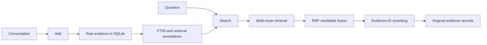

<p align="center">
  
</p>

<h1 align="center">ChronoHybridMem</h1>

<p align="center"><strong>장기 AI 에이전트를 위한 원본 증거 기반 하이브리드 메모리 검색.</strong></p>

<p align="center">
  <a href="README.md">English</a> |
  <a href="README.zh-CN.md">简体中文</a> |
  <a href="README.es.md">Español</a> |
  <a href="README.ja.md">日本語</a> |
  <strong>한국어</strong>
</p>

<!-- README_FACTS: main=stable-post-submission-research; p3=experimental; official-v020-mapping=CONFIRMED -->

<p align="center">
  Agent Memory Challenge · Academic Textual Memory · <strong>Rank 5</strong> · <strong>Overall 44.33</strong>
</p>

ChronoHybridMem은 대화 턴을 저장하고 질의와 가장 관련 있는 원본 증거를 검색하는 Docker 배포형 장기 메모리 서비스입니다. Agent Memory Challenge를 위해 개발되었으며, 의도적으로 증거 검색까지만 담당합니다. 벤치마크의 최종 답변은 생성하지 않습니다.

기본 브랜치 `main`은 현재 검증된 안정적 제출 후 로컬 연구 구현인 P1입니다. 진행 중인 Evidence Graph 작업은 [`research/p3-evidence-graph`](https://github.com/Tin11Mn/chrono-hybrid-mem/tree/research/p3-evidence-graph)에서 별도로 이루어지며 실험 단계이므로 안정 버전 `main`에 포함되지 않습니다.

## 시스템이 하는 일

이 벤치마크는 메모리와 답변 생성을 분리합니다.

| ChronoHybridMem | 대회 플랫폼 |
|---|---|
| `Add`: 대화 증거 저장 | `Answer`: 검색된 증거를 바탕으로 추론 |
| `Search`: 순위가 지정된 원본 레코드 반환 | `Evaluation`: 최종 답변과 메모리 동작 평가 |

예를 들어 메모리에 다음 내용이 있다고 가정합니다.

```text
Bob gave Alice a book.
Bob works at Microsoft.
```

“Where does the person who gave Alice the book work?”라는 질문에 ChronoHybridMem은 위 두 원본 레코드를 검색합니다. 최종 답변 `Microsoft`는 메모리 서비스가 아니라 플랫폼이 생성합니다.

## 아키텍처



안정 서비스는 다음 여섯 가지 원칙을 따릅니다.

- 원본 증거가 최종 기준(source of truth)입니다.
- 검색 주석은 원본 증거를 대체하지 않습니다.
- 모든 저장소 질의는 정확한 `user_id` 파티셔닝을 적용합니다.
- Reranker는 기존 후보 ID의 순서만 변경할 수 있습니다.
- 메모리 Search는 벤치마크 답변을 생성하지 않습니다.
- 복잡성을 추가하기 전에 재현성과 제한된 회귀 테스트를 우선합니다.

## 현재 안정 파이프라인: P1

### Add

1. Pydantic으로 요청을 검증합니다.
2. 멱등성을 보장하는 `request_id` 처리와 함께 원본 메시지를 SQLite에 저장합니다.
3. 선택적으로 `gpt-4o-mini`를 사용해 원본과 연결된 사실 주석을 만듭니다.
4. 원본 메시지, 사실, Porter stemming 텍스트와 인접 문맥을 FTS5로 인덱싱합니다.

화자/날짜 키와 모델 주석은 검색을 개선하지만, `/search`는 항상 원본 메시지 테이블의 콘텐츠를 반환합니다.

### Search

1. 정확한 `user_id` 필터링을 적용합니다.
2. 모델 모드에서 intent, core terms, expansions, entities, temporal cues, evidence needs로 구성된 제한된 질의 필드를 계획합니다.
3. 원본 메시지, 사실, Porter, 인접 문맥 FTS5 경로에서 검색합니다.
4. reciprocal rank fusion(RRF)으로 후보를 결합합니다.
5. 선택적으로 제한된 후보 집합을 `gpt-4o-mini`로 정렬합니다.
6. 모델 출력을 제공된 후보 ID allowlist와 대조해 필터링하고 원본 증거를 반환합니다.

P1은 기존 질의 계획 호출을 재사용합니다. 모델 호출 수를 늘리지 않으며 Add/Search API를 변경하지 않습니다. API 서비스의 기본값은 `MEMORY_STRUCTURED_QUERY_PLAN=true`입니다. flat-planner ablation에는 `false`로 설정하십시오. `MemoryStore` 직접 사용과 오프라인 LoCoMo evaluator는 보수적 기본값을 유지하며, evaluator에서는 `--structured-query-plan` 플래그를 명시해야 합니다. `OPENAI_API_KEY`가 없으면 표준 서비스는 lexical 경로만 사용하고 모델을 호출하지 않습니다.

선택적 BGE, ColBERT, cross-encoder, Qwen 및 기타 로컬 모델 구성 요소는 연구 전용이며 안정 `main` 기본값에 포함되지 않습니다.

## 결과와 증거 수준

### A. 공식 대회 결과

| 트랙 | 순위 | Overall | 확인된 역사 버전 |
|---|---:|---:|---|
| Agent Memory Challenge — Academic Textual Memory | **5** | **44.33** | `v0.2.0` (**주최 측 확인 완료**) |

주최 측은 공식 결과가 [`v0.2.0`](https://github.com/Tin11Mn/chrono-hybrid-mem/tree/v0.2.0), commit `7cf45c76ea7998554a13386b924627b83aeb3134`에 해당함을 공식 확인했습니다. [공식 평가 확인 기록](docs/OFFICIAL_EVALUATION_CONFIRMATION.md)을 참조하십시오. P1과 P3는 제출 후 연구이며 새로운 공식 leaderboard 제출로 해석해서는 안 됩니다.

### B. 안정적 제출 후 로컬 연구

저장소에는 LoCoMo 적격 질문 1,977개에 대한 다음 P1 전체 로컬 실행 결과가 기록되어 있습니다.

| 방법 | Hit@1 | Hit@3 | Hit@10 | MRR |
|---|---:|---:|---:|---:|
| P1 structured planner + local Qwen3-4B proxy | **0.5761** | **0.7157** | **0.7618** | **0.6479** |

이는 2026-08-16에 기록된 역사적 전체 결과로, 제출 후 로컬 LoCoMo 연구이며 공식 leaderboard 결과가 아닙니다. 실행에서는 Search 계획과 증거 정렬에 loopback Qwen3-4B 서버를 사용하고 P1을 명시적으로 활성화했습니다. 1,977개 질문 전체에 대한 flat-planner 대조 실험은 실행하지 않았으므로, 이 표는 전체 집합의 flat-to-P1 개선을 증명하지 않습니다. 프로토콜, 카테고리 지표와 재현 방법은 [P1 Local-Model Evaluation](docs/P1_LOCAL_EVALUATION.md)을 참조하십시오.

### C. Proxy 및 실험적 증거

Fixed-20, fixed-200, AML-like synthetic 및 diagnostic 실행은 leaderboard 결과가 아니라 방법 선택 gate입니다. P1 fixed-200 gate에서는 로컬 Hit@1이 0.545에서 0.565로 향상되고 Hit@10은 0.740으로 유지되었으며, 이후 위의 전체 결과가 기록되었습니다. 폐기된 아이디어를 포함한 자세한 실험 이력은 [findings.md](findings.md), [progress.md](progress.md), [evaluation 문서](docs/EXTERNAL_EVALUATION.md)에 보존되어 있습니다.

Hit@K는 상위 K개 결과 안에 주석된 원본 턴이 하나 이상 있음을 뜻합니다. MRR은 첫 번째 주석된 원본 턴의 순위를 사용합니다. Evidence Recall@K는 주석된 전체 증거 항목 중 검색된 비율입니다.

## 버전 지도

| Ref | 목적 | 상태 |
|---|---|---|
| [`v0.1.0`](https://github.com/Tin11Mn/chrono-hybrid-mem/tree/v0.1.0) | 최소 신뢰형 SQLite/FTS baseline | 보관된 release |
| [`v0.2.0`](https://github.com/Tin11Mn/chrono-hybrid-mem/tree/v0.2.0) | 공식 대회 버전 | 고정 release, 주최 측 확인 완료 |
| [`research-v0.3.0`](https://github.com/Tin11Mn/chrono-hybrid-mem/tree/research-v0.3.0) | BGE + ColBERT 로컬 hybrid milestone | 고정 research tag |
| [`research-v0.4.0`](https://github.com/Tin11Mn/chrono-hybrid-mem/tree/research-v0.4.0) | Qwen reranker + time-aware-key milestone | 고정 research tag |
| [`research-p1-20260816`](https://github.com/Tin11Mn/chrono-hybrid-mem/tree/research-p1-20260816) | Structured query-planning milestone | 안정 research tag |
| [`main`](https://github.com/Tin11Mn/chrono-hybrid-mem) | 현재 검증된 안정적 제출 후 연구 구현 | 활성 |
| [`research/p3-evidence-graph`](https://github.com/Tin11Mn/chrono-hybrid-mem/tree/research/p3-evidence-graph) | P3 Evidence Graph | 실험적 |

간략한 개발 경로는 다음과 같습니다.

```text
v0.1 reliable SQLite/FTS baseline
  → v0.2 model-assisted fact extraction and evidence reranking
  → research-v0.3 dense retrieval and ColBERT
  → research-v0.4 Qwen reranking and a time-aware key
  → P1 structured query planning
  → P3 Evidence Graph research
```

연구 구성 요소는 제한된 회귀 테스트를 통과한 뒤에만 승격됩니다. Entity-bound retrieval, session filtering, ColBERT 변형, 더 큰 reranker, query rewriting 아이디어는 넓은 평가에서 근거가 부족할 때 축소되거나 폐기되었습니다. 이 기록은 안정 기능처럼 제시되지 않고 연구 provenance로 보존됩니다.

## 빠른 시작

ChronoHybridMem의 대상 환경은 Python 3.11입니다.

```bash
git clone https://github.com/Tin11Mn/chrono-hybrid-mem.git
cd chrono-hybrid-mem
python -m venv .venv
```

환경을 활성화합니다.

```bash
# Linux/macOS
source .venv/bin/activate

# Windows PowerShell
.venv\Scripts\Activate.ps1
```

경량 서비스를 설치하고 시작합니다.

```bash
python -m pip install -r requirements.txt
python -m uvicorn app.main:app --host 0.0.0.0 --port 8000
```

상태를 확인합니다.

```bash
curl http://localhost:8000/health
# {"status":"ok"}
```

`.env.example`은 참고 파일이며 자동으로 로드되지 않습니다. 이 프로젝트는 `python-dotenv`를 설치하지 않습니다. shell에서 변수를 export하거나 Docker `--env-file`, 배포 플랫폼의 secret manager를 사용하십시오.

## API

### `POST /add`

`request_id`, `user_id`, `session_id`가 필수입니다. 완료된 `request_id`를 다시 사용해도 멱등성이 유지되어 메시지가 중복 저장되지 않습니다.

```bash
curl -X POST http://localhost:8000/add \
  -H "Content-Type: application/json" \
  -d '{
    "request_id": "run:1:chunk:0",
    "user_id": "run:1:conversation:0",
    "session_id": "run:1:session:0",
    "messages": [
      {"role": "user", "content": "Alice prefers tea.", "timestamp": 1787068800}
    ]
  }'
```

### `POST /search`

`top_k`의 기본값은 100이며 1에서 100 사이여야 합니다. `options`는 선택 사항입니다.

```bash
curl -X POST http://localhost:8000/search \
  -H "Content-Type: application/json" \
  -d '{
    "query": "What does Alice prefer?",
    "user_id": "run:1:conversation:0",
    "top_k": 10
  }'
```

응답 형식:

```json
{
  "data": [
    {
      "id": "mem_1",
      "content": "Alice prefers tea.",
      "score": 0.0164,
      "created_at": "2026-08-18T00:00:00Z"
    }
  ]
}
```

`score`는 내부 검색/결합 점수이며 보정된 확률이 아니고 서로 다른 구성 사이에서 직접 비교할 수 없습니다.

## 구성과 의존성

주요 변수:

| 변수 | 기본값 / 역할 |
|---|---|
| `MEMORY_DB_PATH` | 로컬 SQLite 경로. Docker 기본값은 `/data/chrono_hybrid_mem.db` |
| `MEMORY_REQUIRE_MODEL` | `false`. 모델 기반 시작 시 key가 없으면 실패해야 할 때 `true`로 설정 |
| `MEMORY_STRUCTURED_QUERY_PLAN` | API 서비스에서는 `true`. flat-planner ablation에는 `false` |
| `OPENAI_API_KEY` | 원격 모델 경로 활성화. runtime secret으로 주입 |
| `MEMORY_TEMPORAL_BONUS` | `0`. 선택적인 제한형 lexical temporal bonus |

로컬 연구 switch와 상호 배타적 모델 옵션은 [`.env.example`](.env.example)을 참조하십시오.

의존성 경계:

- [`requirements.txt`](requirements.txt): 경량 API 서비스와 core runtime.
- [`requirements-test.txt`](requirements-test.txt): 주요 CI job의 core/test 의존성. mock HTTP embedding adapter 테스트용 NumPy 추가.
- [`requirements-local.txt`](requirements-local.txt): 선택적 FastEmbed 연구 stack. 모델 가중치는 로컬 구성 요소를 인스턴스화할 때만 다운로드되며 Git에 커밋되지 않습니다.

## Docker

표준 서비스 이미지를 빌드합니다.

```bash
docker build -t chrono-hybrid-mem:latest .
docker run --rm -p 8000:8000 \
  -v chrono-memory-data:/data \
  chrono-hybrid-mem:latest
```

대회형 원격 모델 경로에서는 runtime에 `-e MEMORY_REQUIRE_MODEL=true -e OPENAI_API_KEY=...`를 추가하십시오. key를 이미지에 포함하지 마십시오.

선택적 로컬 연구 이미지는 FastEmbed를 설치하고 BGE-large와 작은 ColBERT reranker를 기본으로 사용합니다.

```bash
docker build -f Dockerfile.local -t chrono-hybrid-mem:local .
docker run --rm -p 8000:8000 \
  -v chrono-memory-data:/data \
  -v chrono-local-models:/models \
  chrono-hybrid-mem:local
```

첫 시작 시 큰 모델 파일을 다운로드할 수 있으므로 충분한 네트워크, 디스크와 메모리가 필요합니다. `Dockerfile.local`은 v0.3 스타일 FastEmbed 연구 경로이며 P1 Qwen 실행을 한 번에 재현하는 이미지가 아닙니다.

## 평가

작은 가상 smoke fixture를 실행합니다.

```bash
python scripts/evaluate_retrieval.py --cases examples/demo_eval.json
```

승인된 로컬 dataset 경로에서 결정론적 LoCoMo prefix 또는 전체 적격 집합을 실행합니다.

```bash
# fixed 20
python scripts/evaluate_locomo_retrieval.py \
  --dataset /path/to/locomo10.json --top-k 1,3,10 --max-questions 20

# fixed 200
python scripts/evaluate_locomo_retrieval.py \
  --dataset /path/to/locomo10.json --top-k 1,3,10 --max-questions 200

# full set: omit --max-questions
python scripts/evaluate_locomo_retrieval.py \
  --dataset /path/to/locomo10.json --top-k 1,3,10
```

`--max-questions`는 무작위 표본이 아니라 고정 prefix를 선택합니다. P1 local-Qwen 프로토콜에는 loopback server, `--local-search-model-url`, `--structured-query-plan`이 추가로 필요합니다. [docs/P1_LOCAL_EVALUATION.md](docs/P1_LOCAL_EVALUATION.md)의 정확한 resumable 절차를 사용하십시오.

일반 검증 명령:

```bash
python -m pip install -r requirements-test.txt
python -m pytest
python -m compileall app tests scripts
```

CI는 경계를 명확히 유지합니다. `Verify / core-verification`은 주요 경량 PR job이며, `Local Research Smoke`는 관련 경로 변경 또는 수동 실행으로만 동작하고 모델 다운로드를 시작하지 않습니다. 외부 LoCoMo와 비용이 발생하는 `gpt-4o-mini` 평가는 수동 workflow입니다. 현재 저장소에는 branch-protection 규칙이 없으므로 GitHub에서 기술적으로 필수인 status check는 없습니다.

## 저장소 구조

```text
app/         FastAPI service, schemas, SQLite storage, retrieval, model adapters
tests/       API, isolation, retrieval, model-contract, and evaluation tests
scripts/     deterministic diagnostics and LoCoMo evaluation tools
evaluation/  AML-like synthetic evaluation material
docs/        protocol, leaderboard audit, diagnostics, and P1 reports
assets/      shared project artwork
```

## 재현성 및 안전 경계

- Python 3.11과 고정된 의존성 파일이 지원 환경을 정의합니다.
- SQLite가 원본 메시지의 영속적 기준이며 생성된 데이터베이스와 평가 출력은 ignore됩니다.
- 정확한 `user_id` 조건은 저장 레코드를 분리하지만 API에는 내장 인증이 없습니다. 운영 배포에서는 외부 서비스 계층이 호출자를 인증하고 신원을 `user_id`에 결합해야 합니다.
- Query, options, memory text는 prompt에서 신뢰할 수 없는 데이터로 취급하며 candidate allowlisting으로 모델 출력을 제한합니다. 이는 완전한 prompt-injection 방어를 주장하는 것이 아니라 완화책입니다.
- OpenAI 기반 경로를 활성화하면 관련 message/query/candidate 내용이 구성된 원격 모델 서비스로 전송됩니다.
- 저장소는 database-at-rest encryption, TLS termination 또는 API rate limiting을 제공하지 않습니다.
- P3는 선언된 promotion gate를 통과하기 전까지 안정 `main`의 일부가 아닙니다. 저장소 관련 수정은 `main`에서 P3로 최소 commit만 전달해야 하며 실험 P3 코드를 안정 P1로 역병합해서는 안 됩니다.

## 인용 및 라이선스

정식 프로젝트 논문을 주장하지 않습니다. 연구에 ChronoHybridMem을 사용한다면 이 저장소 또는 관련 release/tag를 인용해 주십시오.

[MIT License](LICENSE)로 배포됩니다. Copyright © Haoxuan Meng.
