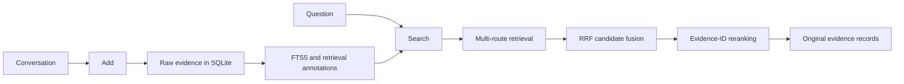

<p align="center">
  
</p>

<h1 align="center">ChronoHybridMem</h1>

<p align="center"><strong>面向长期 AI 智能体、以证据为依据的混合记忆检索系统。</strong></p>

<p align="center">
  <strong>简体中文</strong> |
  <a href="README.en.md">English</a> |
  <a href="README.es.md">Español</a> |
  <a href="README.ja.md">日本語</a> |
  <a href="README.ko.md">한국어</a>
</p>

<!-- README_FACTS: main=stable-post-submission-research; p3=experimental; official-v020-mapping=CONFIRMED -->

<p align="center">
  Agent Memory Challenge · Academic Textual Memory · <strong>Rank 5</strong> · <strong>Overall 44.33</strong>
</p>

ChronoHybridMem 是一项可通过 Docker 部署的长期记忆服务，用于存储对话轮次，并检索与查询最相关的原始证据。该项目为 Agent Memory Challenge 而开发，并有意将功能边界限定在证据检索：它不会生成基准测试所要求的最终答案。

默认分支 `main` 是当前经过验证的稳定版赛后本地研究实现 P1。正在进行的 Evidence Graph 工作独立存放在 [`research/p3-evidence-graph`](https://github.com/Tin11Mn/chrono-hybrid-mem/tree/research/p3-evidence-graph)，属于实验性内容，并非稳定版 `main` 的一部分。

## 系统功能

基准测试将记忆与回答分开：

| ChronoHybridMem | 竞赛平台 |
|---|---|
| `Add`：存储对话证据 | `Answer`：基于检索到的证据进行推理 |
| `Search`：返回经过排序的原始记录 | `Evaluation`：评测最终答案和记忆行为 |

例如，假设记忆中包含：

```text
Bob gave Alice a book.
Bob works at Microsoft.
```

对于“把书送给 Alice 的人在哪里工作？”这一问题，ChronoHybridMem 会检索上述两条来源记录。最终答案 `Microsoft` 由平台生成，而不是由记忆服务生成。

## 架构



稳定版服务遵循六项原则：

- 原始证据是事实的唯一来源。
- 检索注释绝不替代原始证据。
- 每一次存储查询都强制执行精确的 `user_id` 分区。
- 重排序器只能调整已有候选 ID 的顺序。
- 记忆 Search 绝不生成基准测试答案。
- 可复现性和有边界的回归测试优先于增加复杂度。

## 当前稳定版流水线：P1

### Add

1. 使用 Pydantic 验证请求。
2. 将原始消息持久化到 SQLite，并通过 `request_id` 实现幂等处理。
3. 可选使用 `gpt-4o-mini` 创建与来源关联的事实注释。
4. 使用 FTS5 为原始消息、事实、经过 Porter 词干提取的文本和相邻上下文建立索引。

说话人/日期键和模型注释能够改善检索，但 `/search` 始终返回原始消息表中的内容。

### Search

1. 强制执行精确的 `user_id` 过滤。
2. 在模型模式下规划一组范围受限的查询字段：意图、核心词、扩展词、实体、时间线索和证据需求。
3. 通过原始消息、事实、Porter 和相邻上下文 FTS5 路由进行检索。
4. 使用倒数排序融合（RRF）融合候选项。
5. 可选使用 `gpt-4o-mini` 对范围受限的候选集进行排序。
6. 根据所提供的候选 ID 允许列表过滤模型输出，并返回原始证据。

P1 复用现有的查询规划调用；它不会新增模型调用，也不会改变 Add/Search API。API 服务默认设置为 `MEMORY_STRUCTURED_QUERY_PLAN=true`；如需进行扁平规划器消融实验，请将其设为 `false`。直接使用 `MemoryStore` 以及离线 LoCoMo 评测器时仍采取保守策略：评测器要求显式传入 `--structured-query-plan` 标志。如果没有 `OPENAI_API_KEY`，标准服务会走词法路径，不会调用模型。

可选的 BGE、ColBERT、交叉编码器、Qwen 及其他本地模型组件仍仅用于研究，稳定版 `main` 的默认配置并不包含这些组件。

## 结果与证据等级

### A. 官方竞赛结果

| 赛道 | 排名 | 总分 | 已确认的历史版本 |
|---|---:|---:|---|
| Agent Memory Challenge — Academic Textual Memory | **5** | **44.33** | `v0.2.0`（**主办方已确认**） |

主办方已正式确认，官方成绩对应 [`v0.2.0`](https://github.com/Tin11Mn/chrono-hybrid-mem/tree/v0.2.0)，提交为 `7cf45c76ea7998554a13386b924627b83aeb3134`。参见[官方评测确认记录](docs/OFFICIAL_EVALUATION_CONFIRMATION.md)。P1 和 P3 均为赛后研究，不得将其解读为新的官方排行榜提交。

### B. 稳定版赛后本地研究

仓库记录了以下在 1,977 个符合条件的 LoCoMo 问题上完成的 P1 本地全量运行结果：

| 方法 | Hit@1 | Hit@3 | Hit@10 | MRR |
|---|---:|---:|---:|---:|
| P1 结构化规划器 + 本地 Qwen3-4B 代理 | **0.5761** | **0.7157** | **0.7618** | **0.6479** |

这是 2026-08-16 记录的历史全量结果：属于本地赛后 LoCoMo 研究，而非官方排行榜结果。该次运行使用回环 Qwen3-4B 服务器进行 Search 规划和证据排序，并显式启用了 P1。由于没有运行完整的 1,977 问题扁平规划器对照实验，因此该表不能作为全量数据集上从扁平规划器到 P1 的增益证据。有关实验协议、分类指标和复现细节，请参阅 [P1 本地模型评测](docs/P1_LOCAL_EVALUATION.md)。

### C. 代理证据与实验性证据

固定 20、固定 200、AML 风格合成及诊断运行属于方法筛选门槛，而不是排行榜结果。P1 的固定 200 筛选实验将本地 Hit@1 从 0.545 提升到 0.565，同时将 Hit@10 保持在 0.740；之后记录了上述全量结果。详细实验历史（包括被否决的方案）保存在 [findings.md](findings.md)、[progress.md](progress.md) 和[评测文档](docs/EXTERNAL_EVALUATION.md)中。

Hit@K 表示前 K 个结果中至少出现一个已标注的来源轮次。MRR 使用首个已标注来源轮次的排名。Evidence Recall@K 衡量检索到了多少个已标注证据项。


## P3 证据图谱实验（LoCoMo 本地代理）

P3 在不生成新内容的前提下，为原始消息建立可追溯的辅助证据结构；节点和边都必须回指原始消息，`/search` 仍只返回原始证据。P3 目前默认关闭。下列结论只适用于固定 20 题 LoCoMo 开发切片和 Qwen3-4B 本地代理，不能外推为官方全套排行榜结论。

| 子实验 | 方法与结果 | 当前结论 |
|---|---|---|
| P3-A 严格关系图 | 419 条原始消息中仅 3 条形成可独立见证的关系边（来源覆盖率 0.72%）。 | 抽取覆盖不足，未进入成对检索评分。 |
| P3-B1 来源局部实体锚点 | 精确实体提及覆盖 363/419 条来源消息（86.63%）；Hit@1 0.40 → 0.35，Hit@3 0.45 → 0.45，Hit@10 0.55 → 0.50，MRR 0.45 → 0.41。 | 在该切片上退化，不作为全局默认能力。 |
| P1.1 相邻原始消息扩展 | Hit@1/3/10/MRR 与基线相同：0.40/0.45/0.55/0.45。 | 无增益，不进入扩大评测。 |
| P3-C 显式时序状态图 | 尚未实现独立消融。 | 未测试；不能据此判断时序数据效果。 |

这些实验排除了“在 LoCoMo 上默认开启图谱或邻近扩展即可提升”的假设，但不代表图谱在关系密集、多跳或时序数据中无效。后续只会依据可观察到的关系、多跳或时序输入信号选择性启用，绝不会按私有测试集身份或参考答案适配。

## 版本映射

| 引用 | 用途 | 状态 |
|---|---|---|
| [`v0.1.0`](https://github.com/Tin11Mn/chrono-hybrid-mem/tree/v0.1.0) | 最小可靠 SQLite/FTS 基线 | 已归档版本 |
| [`v0.2.0`](https://github.com/Tin11Mn/chrono-hybrid-mem/tree/v0.2.0) | 官方竞赛版本 | 已冻结版本；主办方已确认 |
| [`research-v0.3.0`](https://github.com/Tin11Mn/chrono-hybrid-mem/tree/research-v0.3.0) | BGE + ColBERT 本地混合检索里程碑 | 已冻结研究标签 |
| [`research-v0.4.0`](https://github.com/Tin11Mn/chrono-hybrid-mem/tree/research-v0.4.0) | Qwen 重排序器 + 时间感知键里程碑 | 已冻结研究标签 |
| [`research-p1-20260816`](https://github.com/Tin11Mn/chrono-hybrid-mem/tree/research-p1-20260816) | 结构化查询规划里程碑 | 稳定研究标签 |
| [`main`](https://github.com/Tin11Mn/chrono-hybrid-mem) | 当前经过验证的稳定版赛后研究实现 | 活跃 |
| [`research/p3-evidence-graph`](https://github.com/Tin11Mn/chrono-hybrid-mem/tree/research/p3-evidence-graph) | P3 Evidence Graph | 实验性 |

精简的开发路径如下：

```text
v0.1 reliable SQLite/FTS baseline
  → v0.2 model-assisted fact extraction and evidence reranking
  → research-v0.3 dense retrieval and ColBERT
  → research-v0.4 Qwen reranking and a time-aware key
  → P1 structured query planning
  → P3 Evidence Graph research
```

研究组件只有在通过范围受限的回归测试后才会升级。实体绑定检索、会话过滤、ColBERT 变体、更大的重排序器和查询改写方案，在更广泛的评测未能提供支持时均被削减或否决；这些内容作为研究溯源资料予以保留，而不会被无声地包装成稳定功能。

## 快速开始

ChronoHybridMem 面向 Python 3.11。

```bash
git clone https://github.com/Tin11Mn/chrono-hybrid-mem.git
cd chrono-hybrid-mem
python -m venv .venv
```

激活环境：

```bash
# Linux/macOS
source .venv/bin/activate

# Windows PowerShell
.venv\Scripts\Activate.ps1
```

安装并启动轻量级服务：

```bash
python -m pip install -r requirements.txt
python -m uvicorn app.main:app --host 0.0.0.0 --port 8000
```

检查运行状况：

```bash
curl http://localhost:8000/health
# {"status":"ok"}
```

`.env.example` 仅供参考，并不会自动加载——项目没有安装 `python-dotenv`。请在 shell 中导出变量、向 Docker 传入 `--env-file`，或使用部署平台的密钥管理器。

## API

### `POST /add`

`request_id`、`user_id` 和 `session_id` 为必填项。重复使用已完成的 `request_id` 具有幂等性，不会产生重复消息。

```bash
curl -X POST http://localhost:8000/add \
  -H "Content-Type: application/json" \
  -d '{
    "request_id": "run:1:chunk:0",
    "user_id": "run:1:conversation:0",
    "session_id": "run:1:session:0",
    "messages": [
      {"role": "user", "content": "Alice prefers tea.", "timestamp": 1787068800}
    ]
  }'
```

### `POST /search`

`top_k` 默认值为 100，且必须在 1 到 100 之间。`options` 为可选项。

```bash
curl -X POST http://localhost:8000/search \
  -H "Content-Type: application/json" \
  -d '{
    "query": "What does Alice prefer?",
    "user_id": "run:1:conversation:0",
    "top_k": 10
  }'
```

响应结构：

```json
{
  "data": [
    {
      "id": "mem_1",
      "content": "Alice prefers tea.",
      "score": 0.0164,
      "created_at": "2026-08-18T00:00:00Z"
    }
  ]
}
```

`score` 是内部检索/融合分数，并非经校准的概率，也不能在不同配置之间直接比较。

## 配置与依赖

常用变量：

| 变量 | 默认值/作用 |
|---|---|
| `MEMORY_DB_PATH` | 本地 SQLite 路径；Docker 默认使用 `/data/chrono_hybrid_mem.db` |
| `MEMORY_REQUIRE_MODEL` | `false`；如要求模型后端在缺少密钥时启动失败，请设为 `true` |
| `MEMORY_STRUCTURED_QUERY_PLAN` | API 服务中为 `true`；如需进行扁平规划器消融实验，请设为 `false` |
| `OPENAI_API_KEY` | 启用远程模型路径；应以运行时密钥方式注入 |
| `MEMORY_TEMPORAL_BONUS` | `0`；可选的有界词法时间加成 |

有关本地研究开关和互斥模型选项，请参阅 [`.env.example`](.env.example)。

依赖边界：

- [`requirements.txt`](requirements.txt)：轻量级 API 服务和核心运行时。
- [`requirements-test.txt`](requirements-test.txt)：主要 CI 任务使用的核心/测试依赖；额外加入 NumPy，以支持模拟 HTTP 嵌入适配器测试。
- [`requirements-local.txt`](requirements-local.txt)：可选的 FastEmbed 研究栈。只有实例化本地组件时才会下载模型权重，并且绝不会将其提交到仓库。

## Docker

构建标准服务镜像：

```bash
docker build -t chrono-hybrid-mem:latest .
docker run --rm -p 8000:8000 \
  -v chrono-memory-data:/data \
  chrono-hybrid-mem:latest
```

如需使用竞赛风格的远程模型路径，请在运行时添加 `-e MEMORY_REQUIRE_MODEL=true -e OPENAI_API_KEY=...`；绝不要将密钥烘焙进镜像。

可选的本地研究镜像会安装 FastEmbed，并默认使用 BGE-large 和一个小型 ColBERT 重排序器：

```bash
docker build -f Dockerfile.local -t chrono-hybrid-mem:local .
docker run --rm -p 8000:8000 \
  -v chrono-memory-data:/data \
  -v chrono-local-models:/models \
  chrono-hybrid-mem:local
```

首次启动可能会下载大型模型文件，需要充足的网络、磁盘和内存资源。`Dockerfile.local` 代表 v0.3 风格的 FastEmbed 研究路径；它不能通过一条命令复现 P1 Qwen 运行。

## 评测

运行小型虚构冒烟测试夹具：

```bash
python scripts/evaluate_retrieval.py --cases examples/demo_eval.json
```

从经过批准的本地数据集路径运行确定性的 LoCoMo 前缀或完整的符合条件数据集：

```bash
# fixed 20
python scripts/evaluate_locomo_retrieval.py \
  --dataset /path/to/locomo10.json --top-k 1,3,10 --max-questions 20

# fixed 200
python scripts/evaluate_locomo_retrieval.py \
  --dataset /path/to/locomo10.json --top-k 1,3,10 --max-questions 200

# full set: omit --max-questions
python scripts/evaluate_locomo_retrieval.py \
  --dataset /path/to/locomo10.json --top-k 1,3,10
```

`--max-questions` 选择固定前缀，而不是随机样本。P1 本地 Qwen 协议还要求回环服务器、`--local-search-model-url` 和 `--structured-query-plan`；请使用 [docs/P1_LOCAL_EVALUATION.md](docs/P1_LOCAL_EVALUATION.md) 中准确的可恢复执行流程。

常规验证：

```bash
python -m pip install -r requirements-test.txt
python -m pytest
python -m compileall app tests scripts
```

CI 明确划分各项边界：`Verify / core-verification` 是主要的轻量级 PR 任务；`Local Research Smoke` 仅在匹配路径或手动触发时运行，并且绝不会开始下载模型。外部 LoCoMo 评测和付费 `gpt-4o-mini` 评测均为手动工作流。仓库目前没有分支保护规则，因此 GitHub 在技术上不强制要求任何状态检查。

## 仓库结构

```text
app/         FastAPI service, schemas, SQLite storage, retrieval, model adapters
tests/       API, isolation, retrieval, model-contract, and evaluation tests
scripts/     deterministic diagnostics and LoCoMo evaluation tools
evaluation/  AML-like synthetic evaluation material
docs/        protocol, leaderboard audit, diagnostics, and P1 reports
assets/      shared project artwork
```

## 可复现性与安全边界

- Python 3.11 和固定版本的依赖文件定义了受支持的环境。
- SQLite 是原始消息的持久化来源；生成的数据库和评测输出会被忽略。
- 精确的 `user_id` 谓词用于隔离已存储记录，但 API 不包含内置身份验证。生产部署必须验证调用方身份，并在外层服务中将其身份与 `user_id` 绑定。
- 查询、选项和记忆文本均被视为不可信的提示数据；候选允许列表可以限制模型输出。这是一项缓解措施，而不是对完全防止提示注入的承诺。
- 启用 OpenAI 支持的路径，会把相关的消息/查询/候选内容发送给所配置的远程模型服务。
- 本仓库不提供数据库静态加密、TLS 终止或 API 速率限制。
- 在 P3 通过已声明的升级门槛前，它不属于稳定版 `main`。仅涉及仓库的修复应以最小提交的形式从 `main` 流入 P3，绝不能通过将实验性 P3 代码合并回稳定版 P1 的方式实现。

## 引用与许可证

本项目未宣称存在正式论文。如果您在研究中使用 ChronoHybridMem，请引用本仓库或相应的发布版本/标签。

本项目依据 [MIT License](LICENSE) 发布。Copyright © Haoxuan Meng。
