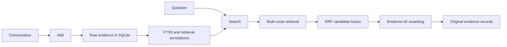

<p align="center">
  
</p>

<h1 align="center">ChronoHybridMem</h1>

<p align="center"><strong>Evidence-grounded hybrid memory retrieval for long-term AI agents.</strong></p>

<p align="center">
  <strong>English</strong> |
  <a href="README.zh-CN.md">简体中文</a> |
  <a href="README.es.md">Español</a> |
  <a href="README.ja.md">日本語</a> |
  <a href="README.ko.md">한국어</a>
</p>

<!-- README_FACTS: main=stable-post-submission-research; p3=experimental; official-v020-mapping=CONFIRMED -->

<p align="center">
  Agent Memory Challenge · Academic Textual Memory · <strong>Rank 5</strong> · <strong>Overall 44.33</strong>
</p>

ChronoHybridMem is a Docker-deployable long-term memory service that stores conversation turns and retrieves the original evidence most relevant to a query. It was developed for the Agent Memory Challenge and deliberately stops at evidence retrieval: it does not generate the benchmark's final answer.

The default branch, `main`, is the current validated stable post-submission local research implementation, P1. Ongoing Evidence Graph work lives separately on [`research/p3-evidence-graph`](https://github.com/Tin11Mn/chrono-hybrid-mem/tree/research/p3-evidence-graph) and is experimental—not part of stable `main`.

## What the system does

The benchmark separates memory from answering:

| ChronoHybridMem | Competition platform |
|---|---|
| `Add`: store conversation evidence | `Answer`: reason over retrieved evidence |
| `Search`: return ranked original records | `Evaluation`: score the final answer and memory behavior |

For example, suppose memory contains:

```text
Bob gave Alice a book.
Bob works at Microsoft.
```

For “Where does the person who gave Alice the book work?”, ChronoHybridMem retrieves those two source records. The platform—not the memory service—produces `Microsoft` as the final answer.

## Architecture



The stable service follows six principles:

- Raw evidence is the source of truth.
- Retrieval annotations never replace the original evidence.
- Every storage query enforces exact `user_id` partitioning.
- A reranker may reorder existing candidate IDs only.
- Memory Search never generates the benchmark answer.
- Reproducibility and bounded regression tests come before added complexity.

## Current stable pipeline: P1

### Add

1. Validate the request with Pydantic.
2. Persist the original messages in SQLite with idempotent `request_id` handling.
3. Optionally use `gpt-4o-mini` to create source-linked fact annotations.
4. Index raw messages, facts, Porter-stemmed text, and neighboring context with FTS5.

Speaker/date keys and model annotations improve retrieval, but `/search` always returns content from the original message table.

### Search

1. Enforce exact `user_id` filtering.
2. Plan bounded query fields in model mode: intent, core terms, expansions, entities, temporal cues, and evidence needs.
3. Retrieve through raw-message, fact, Porter, and neighboring-context FTS5 routes.
4. Fuse candidates with reciprocal rank fusion (RRF).
5. Optionally order a bounded candidate set with `gpt-4o-mini`.
6. Filter model output against the supplied candidate-ID allowlist and return original evidence.

P1 reuses the existing query-planning call; it adds no model call and does not change the Add/Search API. The API service defaults to `MEMORY_STRUCTURED_QUERY_PLAN=true`; set it to `false` for a flat-planner ablation. Direct `MemoryStore` use and the offline LoCoMo evaluator remain conservative: the evaluator requires the explicit `--structured-query-plan` flag. Without an `OPENAI_API_KEY`, the standard service follows its lexical path and does not call a model.

Optional BGE, ColBERT, cross-encoder, Qwen, and other local-model components remain research-only and are not implied by stable `main` defaults.

## Results and evidence level

### A. Official competition result

| Track | Rank | Overall | Confirmed historical version |
|---|---:|---:|---|
| Agent Memory Challenge — Academic Textual Memory | **5** | **44.33** | `v0.2.0` (**organizer-confirmed**) |

The organizer has formally confirmed that the official result corresponds to [`v0.2.0`](https://github.com/Tin11Mn/chrono-hybrid-mem/tree/v0.2.0), commit `7cf45c76ea7998554a13386b924627b83aeb3134`. See the [official evaluation confirmation record](docs/OFFICIAL_EVALUATION_CONFIRMATION.md). P1 and P3 are post-submission research and must not be read as new official leaderboard submissions.

### B. Stable post-submission local research

The repository records the following full local P1 run on 1,977 eligible LoCoMo questions:

| Method | Hit@1 | Hit@3 | Hit@10 | MRR |
|---|---:|---:|---:|---:|
| P1 structured planner + local Qwen3-4B proxy | **0.5761** | **0.7157** | **0.7618** | **0.6479** |

This is a historical recorded full result from 2026-08-16: local post-submission LoCoMo research, not an official leaderboard result. The run used a loopback Qwen3-4B server for Search planning and evidence ordering, with P1 explicitly enabled. A full 1,977-question flat-planner control was not run, so the table is not evidence of a full-set flat-to-P1 delta. See [P1 Local-Model Evaluation](docs/P1_LOCAL_EVALUATION.md) for protocol, category metrics, and reproduction details.

### C. Proxy and experimental evidence

Fixed-20, fixed-200, AML-like synthetic, and diagnostic runs are method-selection gates rather than leaderboard results. The P1 fixed-200 gate improved local Hit@1 from 0.545 to 0.565 while preserving Hit@10 at 0.740; the full result above was then recorded. Detailed experimental history—including rejected ideas—is preserved in [findings.md](findings.md), [progress.md](progress.md), and [evaluation documentation](docs/EXTERNAL_EVALUATION.md).

Hit@K means at least one annotated source turn appears in the first K results. MRR uses the rank of the first annotated source turn. Evidence Recall@K measures how many annotated evidence items were retrieved.

## Version map

| Ref | Purpose | Status |
|---|---|---|
| [`v0.1.0`](https://github.com/Tin11Mn/chrono-hybrid-mem/tree/v0.1.0) | Minimal reliable SQLite/FTS baseline | Archived release |
| [`v0.2.0`](https://github.com/Tin11Mn/chrono-hybrid-mem/tree/v0.2.0) | Official competition version | Frozen release; organizer-confirmed |
| [`research-v0.3.0`](https://github.com/Tin11Mn/chrono-hybrid-mem/tree/research-v0.3.0) | BGE + ColBERT local hybrid milestone | Frozen research tag |
| [`research-v0.4.0`](https://github.com/Tin11Mn/chrono-hybrid-mem/tree/research-v0.4.0) | Qwen reranker + time-aware-key milestone | Frozen research tag |
| [`research-p1-20260816`](https://github.com/Tin11Mn/chrono-hybrid-mem/tree/research-p1-20260816) | Structured query-planning milestone | Stable research tag |
| [`main`](https://github.com/Tin11Mn/chrono-hybrid-mem) | Current validated stable post-submission research implementation | Active |
| [`research/p3-evidence-graph`](https://github.com/Tin11Mn/chrono-hybrid-mem/tree/research/p3-evidence-graph) | P3 Evidence Graph | Experimental |

The compact development path is:

```text
v0.1 reliable SQLite/FTS baseline
  → v0.2 model-assisted fact extraction and evidence reranking
  → research-v0.3 dense retrieval and ColBERT
  → research-v0.4 Qwen reranking and a time-aware key
  → P1 structured query planning
  → P3 Evidence Graph research
```

Research components are promoted only after bounded regression tests. Entity-bound retrieval, session filtering, ColBERT variants, larger rerankers, and query-rewriting ideas were reduced or rejected when broader evaluation failed to support them; they are preserved as research provenance rather than silently presented as stable features.

## Quick start

ChronoHybridMem targets Python 3.11.

```bash
git clone https://github.com/Tin11Mn/chrono-hybrid-mem.git
cd chrono-hybrid-mem
python -m venv .venv
```

Activate the environment:

```bash
# Linux/macOS
source .venv/bin/activate

# Windows PowerShell
.venv\Scripts\Activate.ps1
```

Install and start the lightweight service:

```bash
python -m pip install -r requirements.txt
python -m uvicorn app.main:app --host 0.0.0.0 --port 8000
```

Check health:

```bash
curl http://localhost:8000/health
# {"status":"ok"}
```

`.env.example` is a reference, not an automatically loaded file—the project does not install `python-dotenv`. Export variables in your shell, pass Docker `--env-file`, or use your deployment platform's secret manager.

## API

### `POST /add`

`request_id`, `user_id`, and `session_id` are required. Reusing a completed `request_id` is idempotent and does not duplicate messages.

```bash
curl -X POST http://localhost:8000/add \
  -H "Content-Type: application/json" \
  -d '{
    "request_id": "run:1:chunk:0",
    "user_id": "run:1:conversation:0",
    "session_id": "run:1:session:0",
    "messages": [
      {"role": "user", "content": "Alice prefers tea.", "timestamp": 1787068800}
    ]
  }'
```

### `POST /search`

`top_k` defaults to 100 and must be between 1 and 100. `options` is optional.

```bash
curl -X POST http://localhost:8000/search \
  -H "Content-Type: application/json" \
  -d '{
    "query": "What does Alice prefer?",
    "user_id": "run:1:conversation:0",
    "top_k": 10
  }'
```

Response shape:

```json
{
  "data": [
    {
      "id": "mem_1",
      "content": "Alice prefers tea.",
      "score": 0.0164,
      "created_at": "2026-08-18T00:00:00Z"
    }
  ]
}
```

`score` is an internal retrieval/fusion score, not a calibrated probability and not directly comparable across configurations.

## Configuration and dependencies

Common variables:

| Variable | Default / role |
|---|---|
| `MEMORY_DB_PATH` | Local SQLite path; Docker defaults to `/data/chrono_hybrid_mem.db` |
| `MEMORY_REQUIRE_MODEL` | `false`; set `true` when model-backed startup must fail without a key |
| `MEMORY_STRUCTURED_QUERY_PLAN` | `true` for the API service; set `false` for a flat-planner ablation |
| `OPENAI_API_KEY` | Enables the remote model path; inject as a runtime secret |
| `MEMORY_TEMPORAL_BONUS` | `0`; optional bounded lexical temporal bonus |

See [`.env.example`](.env.example) for local research switches and mutually exclusive model options.

Dependency boundaries:

- [`requirements.txt`](requirements.txt): lightweight API service and core runtime.
- [`requirements-test.txt`](requirements-test.txt): core/test dependencies used by the primary CI job; adds NumPy for the mocked HTTP embedding adapter tests.
- [`requirements-local.txt`](requirements-local.txt): optional FastEmbed research stack. Model weights are downloaded only when a local component is instantiated and are never committed.

## Docker

Build the standard service image:

```bash
docker build -t chrono-hybrid-mem:latest .
docker run --rm -p 8000:8000 \
  -v chrono-memory-data:/data \
  chrono-hybrid-mem:latest
```

For the competition-style remote model path, add `-e MEMORY_REQUIRE_MODEL=true -e OPENAI_API_KEY=...` at runtime; never bake the key into the image.

The optional local research image installs FastEmbed and defaults to BGE-large plus a small ColBERT reranker:

```bash
docker build -f Dockerfile.local -t chrono-hybrid-mem:local .
docker run --rm -p 8000:8000 \
  -v chrono-memory-data:/data \
  -v chrono-local-models:/models \
  chrono-hybrid-mem:local
```

First startup may download large model files and requires adequate network, disk, and memory. `Dockerfile.local` represents the v0.3-style FastEmbed research path; it is not a one-command reproduction of the P1 Qwen run.

## Evaluation

Run the small fictional smoke fixture:

```bash
python scripts/evaluate_retrieval.py --cases examples/demo_eval.json
```

Run deterministic LoCoMo prefixes or the full eligible set from an approved local dataset path:

```bash
# fixed 20
python scripts/evaluate_locomo_retrieval.py \
  --dataset /path/to/locomo10.json --top-k 1,3,10 --max-questions 20

# fixed 200
python scripts/evaluate_locomo_retrieval.py \
  --dataset /path/to/locomo10.json --top-k 1,3,10 --max-questions 200

# full set: omit --max-questions
python scripts/evaluate_locomo_retrieval.py \
  --dataset /path/to/locomo10.json --top-k 1,3,10
```

`--max-questions` selects a fixed prefix, not a random sample. The P1 local-Qwen protocol additionally requires a loopback server, `--local-search-model-url`, and `--structured-query-plan`; use the exact resumable procedure in [docs/P1_LOCAL_EVALUATION.md](docs/P1_LOCAL_EVALUATION.md).

For ordinary verification:

```bash
python -m pip install -r requirements-test.txt
python -m pytest
python -m compileall app tests scripts
```

CI keeps boundaries explicit: `Verify / core-verification` is the primary lightweight PR job; `Local Research Smoke` is path-scoped or manually triggered and never starts model downloads. External LoCoMo and paid `gpt-4o-mini` evaluations are manual workflows. The repository currently has no branch-protection rule, so no status check is technically required by GitHub.

## Repository structure

```text
app/         FastAPI service, schemas, SQLite storage, retrieval, model adapters
tests/       API, isolation, retrieval, model-contract, and evaluation tests
scripts/     deterministic diagnostics and LoCoMo evaluation tools
evaluation/  AML-like synthetic evaluation material
docs/        protocol, leaderboard audit, diagnostics, and P1 reports
assets/      shared project artwork
```

## Reproducibility and safety boundaries

- Python 3.11 and pinned dependency files define the supported environment.
- SQLite is the durable source of raw messages; generated databases and evaluation outputs are ignored.
- Exact `user_id` predicates isolate stored records, but the API has no built-in authentication. Production deployments must authenticate callers and bind their identity to `user_id` at the outer service layer.
- Query, options, and memory text are treated as untrusted prompt data; candidate allowlisting limits model output. This is a mitigation, not a claim of complete prompt-injection prevention.
- Enabling the OpenAI-backed path sends relevant message/query/candidate content to the configured remote model service.
- The repository does not provide database-at-rest encryption, TLS termination, or API rate limiting.
- P3 is not part of stable `main` until it passes its declared promotion gates. Repository-only fixes should flow from `main` into P3 as minimal commits, never by merging experimental P3 code back into stable P1.

## Citation and license

No formal project paper is claimed. If you use ChronoHybridMem in research, cite this repository or the relevant release/tag.

Released under the [MIT License](LICENSE). Copyright © Haoxuan Meng.
